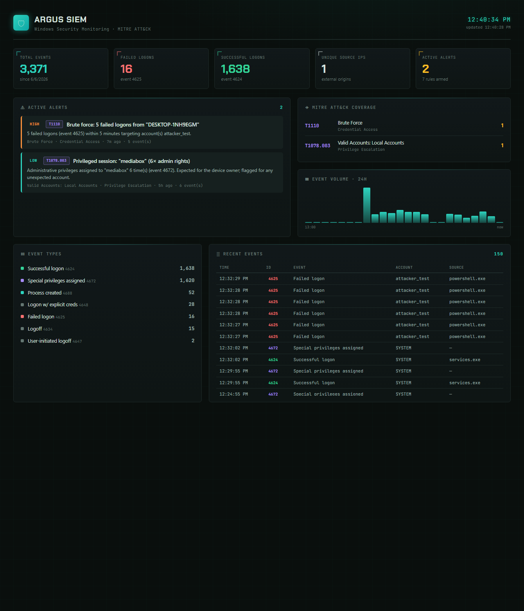

# 🛡 Argus SIEM

A lightweight **Security Information and Event Management** system that monitors Windows Security logs, detects attacker behavior with rules mapped to **MITRE ATT&CK**, and surfaces alerts on a real-time dashboard.

Built to demonstrate hands-on **SOC analyst** skills: log collection, normalization, detection engineering, alert tuning, and threat visualization — the daily work of a Security Operations Center.

> Runs on real Windows Security Event Log data. Zero runtime dependencies — pure Node.js + PowerShell.



> *Argus catching a brute-force attack in real time — failed logons spiking, a HIGH-severity alert mapped to **MITRE T1110**, and live ATT&CK coverage. Validate it yourself with [`simulate-attack.ps1`](simulate-attack.ps1).*

---

## What it does

```
 Windows Security Log          Collector            Detection Engine         Dashboard
 ┌──────────────────┐      ┌──────────────┐      ┌──────────────────┐    ┌────────────┐
 │ 4624 logon       │      │ Get-WinEvent │      │ 7 rules, each    │    │ live feed  │
 │ 4625 failed      │ ───▶ │ normalize to │ ───▶ │ mapped to MITRE  │──▶ │ alerts     │
 │ 4672 priv assign │      │ JSONL store  │      │ ATT&CK technique │    │ MITRE grid │
 │ 4720 new account │      │ (incremental)│      │ + alert tuning   │    │ 24h volume │
 │ 1102 log cleared │      └──────────────┘      └──────────────────┘    └────────────┘
 └──────────────────┘
```

1. **Collect** — a PowerShell collector pulls SOC-relevant Security events (`Get-WinEvent`), normalizes them to a flat schema, and appends to an incremental JSONL event store.
2. **Detect** — a Node detection engine runs 7 behavioral rules over the event stream, each mapped to a MITRE ATT&CK technique.
3. **Alert & Visualize** — a real-time dashboard shows alerts (severity-ranked), MITRE coverage, event volume, and a live event feed.

---

## Detection rules

| Rule | Trigger | Severity | MITRE ATT&CK |
|------|---------|----------|--------------|
| Brute-force logon | ≥5 failed logons (4625) from one source in 5 min | High | **T1110** Brute Force |
| Cracked credential | Successful logon (4624) after ≥3 failures in 10 min | Critical | **T1110 → T1078** |
| Account lockout | Lockout event (4740) | Medium | **T1110** |
| New account created | Account creation (4720) | Medium | **T1136.001** Create Account |
| Privileged session | Admin rights assigned (4672) to a real user | Low | **T1078.003** Valid Accounts |
| Audit log cleared | Security log cleared (1102) | Critical | **T1070.001** Indicator Removal |
| Off-hours logon | Interactive/RDP logon 02:00–06:00 | Low | **T1078** Valid Accounts |

### Alert tuning (the SOC skill)
Event `4672` fires constantly for `SYSTEM` and service/virtual accounts (`sshd_*`, GUID accounts, window manager). A naive rule produced **28 alerts** — almost all false positives. After filtering service/virtual accounts and **aggregating per account**, the same data produces **1 meaningful alert**. Reducing analyst alert fatigue is the core of detection engineering.

---

## Tech stack

- **Collector:** Windows PowerShell (`Get-WinEvent`, XML event parsing, incremental state)
- **Backend:** Node.js — raw `http` + `fs`, **zero dependencies**
- **Detection engine:** plain JS rules, each independently testable
- **Dashboard:** vanilla JS, tactical HUD theme, auto-refresh
- **Store:** append-only JSONL event log (SIEM-style)

---

## Run it

```powershell
# 1. Collect events (needs admin — Security log is privileged)
.\collector\collect.ps1

# 2. Start the dashboard
node server.js
#    → http://localhost:3001
```

### Validate the detections
```powershell
.\simulate-attack.ps1     # generates real failed logons against a FAKE account
.\collector\collect.ps1   # re-collect
#    → dashboard shows a HIGH-severity brute-force alert (MITRE T1110)
```

Auto-run is wired via two scheduled tasks: **Argus Collector** (every 5 min, elevated) keeps data fresh, **Argus SIEM** starts the dashboard at logon.

---

## Roadmap
- [ ] Sysmon ingestion (process trees, network connections) for deeper detections
- [ ] SQLite store for larger event volumes + historical queries
- [ ] Email / push alerting on critical detections
- [ ] Sigma-rule import (industry-standard detection format)
- [ ] GeoIP enrichment for external source IPs

---

*Privacy: the `data/` folder holds real Security log events from the host machine and is git-ignored — never published.*
